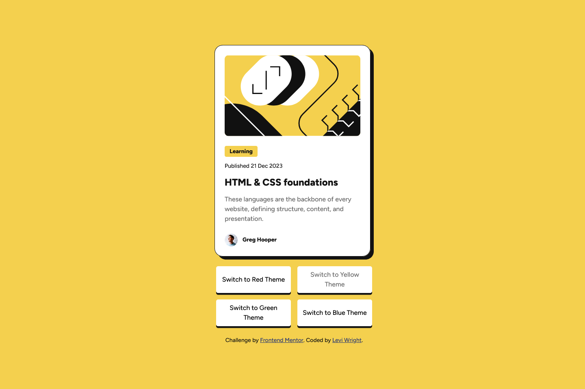
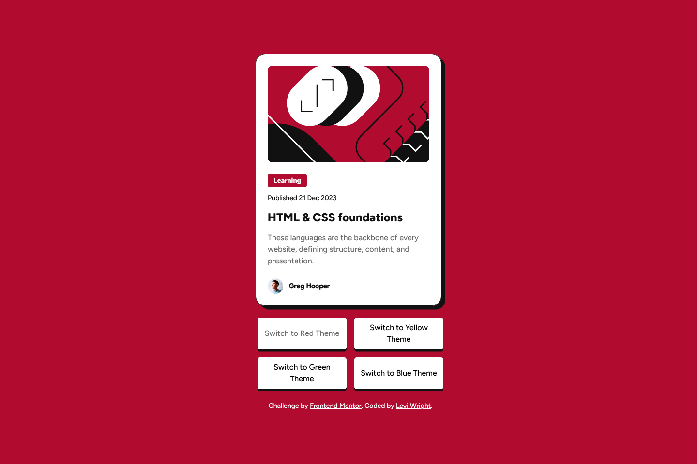
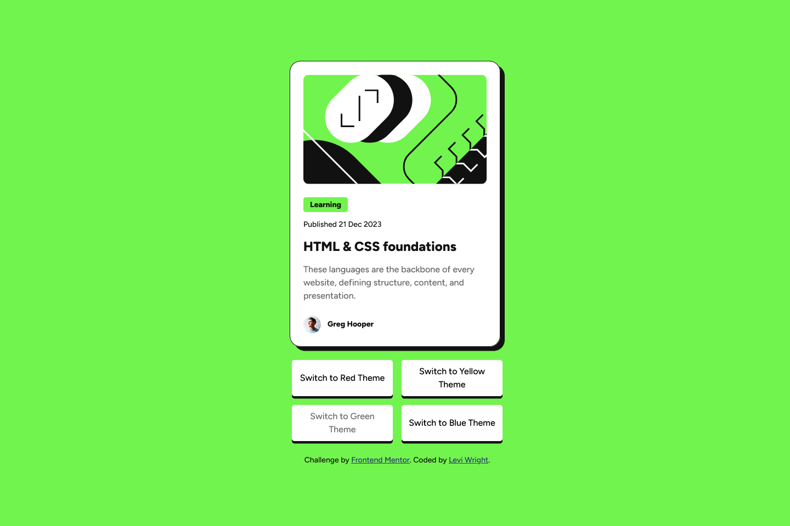
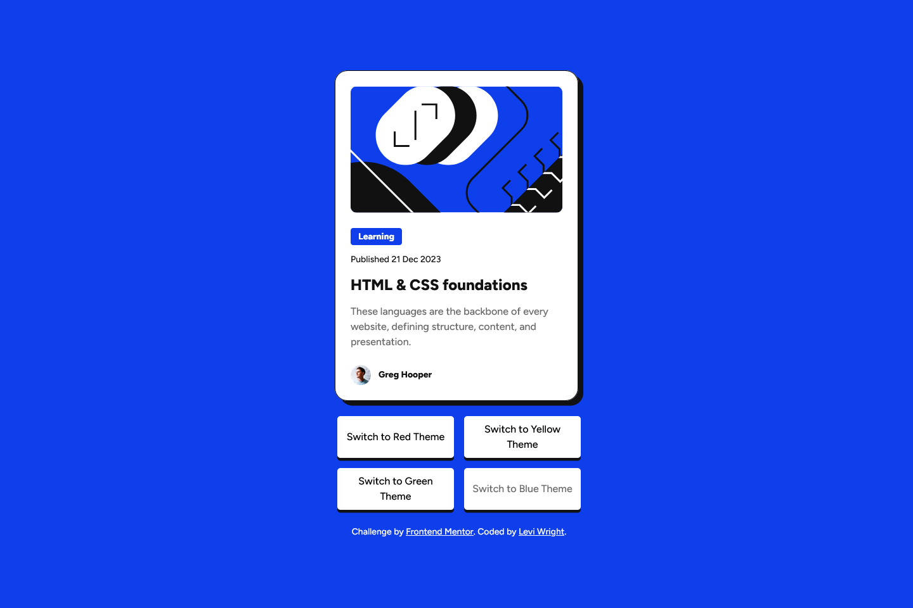

# Frontend Mentor - Blog preview card solution

This is a solution to the [Blog Preview Card Challenge on Frontend Mentor](https://www.frontendmentor.io/challenges/blog-preview-card-ckPaj01IcS). Frontend Mentor challenges help you improve your coding skills by building realistic projects. 

## Table of contents

- [Overview](#overview)
  - [The Challenge](#the-challenge)
  - [Screenshot](#screenshot)
  - [Links](#links)
- [My Process](#my-process)
  - [Built With](#built-with)
  - [What I Learned](#what-i-learned)
  - [Continued Development](#continued-development)
- [Author](#author)

## Overview

### The Challenge

Users should be able to:

- See hover and focus states for all interactive elements on the page

### Screenshot






### Links

- Solution URL: [Frontend Mentor](https://www.frontendmentor.io/solutions/blog-preview-card-with-scss-color-variants-7RZbyRZUKR)
- Live Site URL: [GitHub Pages](https://law973.github.io/blog-preview-card/)

## My Process

### Built With

- Semantic HTML
- CSS Flexbox
- CSS Grid
- SCSS
- CSS/SCSS variables
- SCSS extends and mixins
- JavaScript
- Mobile-first workflow

### What I Learned

I became more familiar with the font shorthand during this challenge and found that line-height can be added to it, separated from the font-size with a slash:

```css
font: 500 initial/1.5 $font-stack;
```

I also got more practice with mixins and learned more about the ways that variables can be plugged into styling, with this usage of string interpolation being a prime example:

```css
@mixin selected-button-colors($bg-c, $c: "gray-950") {
    #theme_switcher_#{$bg-c} {
        &:hover:not([disabled]), &:active, &:focus {
            background-color: var(--#{$bg-c});
            color: var(--#{$c});
        }
    }
}
```

### Continued Development

I want to continue refining my skills in, and expanding my knowledge of, JavaScript. I also want to become better with styling images, styling svgs, and taking accessibility into account.

## Author

- Website - [Levi Wright](https://leviwright.netlify.app/)
- Frontend Mentor - [@law973](https://www.frontendmentor.io/profile/law973)
- LinkedIn - [Levi Wright](https://www.linkedin.com/in/levi-arthur-wright/)
- GitHub - [@law973](https://github.com/law973)
